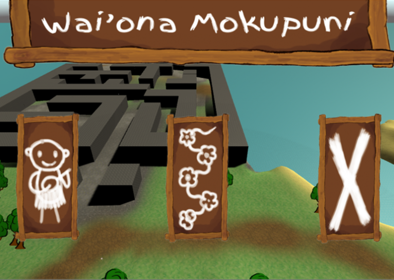
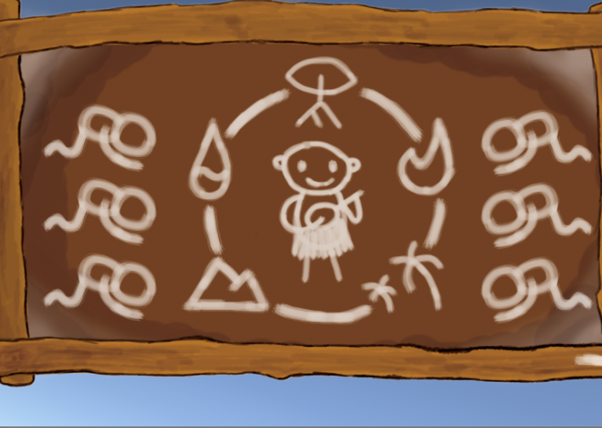
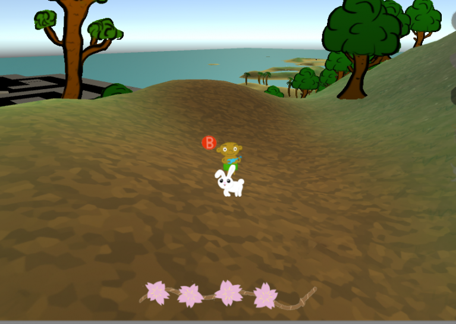

# Wai'ona Mokupuni

Many thousands of years ago, an evil power was banished to the Lua Pele volcano on Hawaii. Every evening, the island's priests  renew the seal using 5 elemental relicts. But every few centuries, the evil one manages to scatter the relics on the island and regain some of its power. Now it's time again and this time it's up to the boy (Lókahi) to find the five elemental relics, restore the altar (Lua Pele) to seal the evil again, and bring nature back into balance.

Made during the [Global Game Jam 2016](https://globalgamejam.org/).

### [Download Executables](./Releases)

  

